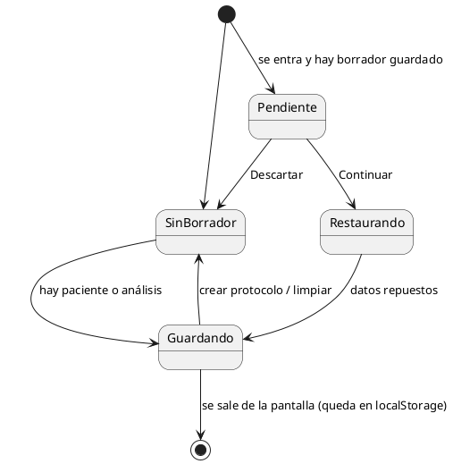
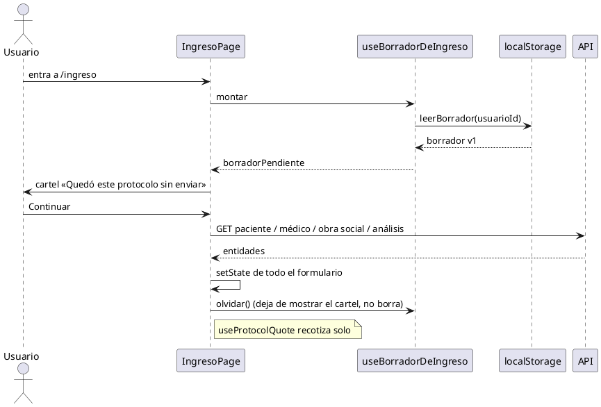
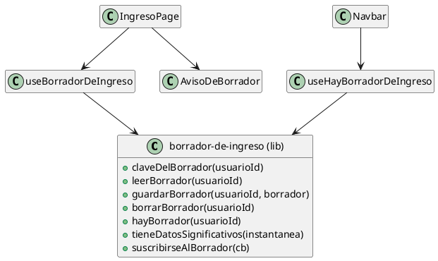

# Plan: borrador de ingreso (protocolo a medio cargar)

Rama: `feature/borrador-ingreso` (repo `frontend`, base `desarrollo`).

## 1. Contexto

En `/ingreso` se carga un protocolo con muchos campos (paciente, médico, obra
social, análisis, pagos, orden, preautorización, extras). Hoy salir de la
pantalla pierde todo: el componente se desmonta y el estado se va con él.

Pedido del usuario: poder dejar un ingreso a medias, salir, volver y seguir.
Mientras hay algo a medias, el ítem **Ingreso** de la navbar se pinta de
amarillo; al volver a la pantalla aparece un cartel que ofrece **continuar** o
**descartar**. Todo en `localStorage`: por PC, nunca en el servidor.

Decisión tomada con el usuario: el borrador es **por PC y por usuario**. La
clave lleva el id del usuario logueado; otro usuario en la misma máquina no ve
el borrador ajeno, y cerrar sesión no lo borra.

## 2. Requerimientos

### Funcionales

| # | Requerimiento |
|---|---|
| RF1 | Mientras se carga un ingreso con datos significativos, el estado del formulario se guarda en `localStorage` del navegador. |
| RF2 | El borrador es por usuario: la clave incluye el id del usuario logueado. |
| RF3 | Al volver a `/ingreso` con un borrador guardado, se muestra un cartel: «Quedó este protocolo sin enviar», con «Continuar» y «Descartar». |
| RF4 | «Continuar» reconstruye el formulario completo (incluido el botón «Crear Protocolo» al pie, que ya aparece cuando hay paciente). |
| RF5 | «Descartar» borra el borrador y deja el formulario limpio para un ingreso nuevo. |
| RF6 | Con borrador guardado y estando fuera de `/ingreso`, el ítem «Ingreso» de la navbar se muestra en ámbar (escritorio y mobile). |
| RF7 | El borrador se borra al crear el protocolo con éxito, al descartarlo y al usar «limpiar» del formulario. |
| RF8 | «Datos significativos» = hay paciente elegido **o** al menos un análisis. Un formulario vacío no genera borrador. |
| RF9 | Hasta que el usuario decida (continuar/descartar), el formulario vacío NO sobreescribe el borrador. |

### No funcionales

| # | Requerimiento |
|---|---|
| RNF1 | Todo acceso a `localStorage` va en `try/catch`: cuota llena, modo privado o JSON corrupto degradan a «no hay borrador», nunca a pantalla en blanco. |
| RNF2 | El borrador lleva `version` de esquema. Versión distinta ⇒ se descarta y se borra. |
| RNF3 | El guardado va con debounce (~600 ms) para no escribir en cada tecla. |
| RNF4 | **PHI mínima.** No se guardan nombre, DNI ni datos del paciente: sólo ids. Al restaurar se vuelven a pedir al backend. |
| RNF5 | La navbar reacciona sin recargar: evento custom propio + evento `storage` (otra pestaña). |
| RNF6 | `npm run build` limpio y `npm run lint` sin sumar warnings (baseline 28 warnings, 0 errores). |
| RNF7 | Textos en español rioplatense. Identificadores y comentarios en español. |

### PHI / seguridad (contexto médico)

Lo que queda en el disco del cliente es una lista de **ids numéricos**:
paciente, médico, obra social, método de envío, análisis, y montos. No hay
nombre, ni DNI, ni código de análisis legible. Aun así es dato de salud por
asociación: quien tenga acceso al perfil del navegador y a la base puede
resolver «el paciente 8412 tenía pedidos los análisis 33 y 91». Mitigaciones
adoptadas: clave por usuario, borrado al cerrar el protocolo o descartar, y
ningún campo de texto libre del paciente. El número de afiliado sí se guarda
(es un dato del trámite, necesario para reconstruir el formulario) — queda
anotado como el dato más sensible del payload.

## 3. Casos de uso

**CU1 — Retomar un ingreso.** Actor: recepción. Precondición: hay borrador del
usuario. Flujo: entra a Ingreso → ve el cartel → «Continuar» → se piden los
datos al backend y el formulario queda como estaba → termina y crea el
protocolo. Postcondición: protocolo creado y borrador borrado.
Alternativo: «Descartar» ⇒ formulario limpio, borrador borrado.
Alternativo: el paciente/análisis fue borrado en el backend ⇒ se avisa con
toast y se restaura lo que sí existe.

**CU2 — Ver que quedó algo pendiente.** Actor: recepción. Está en otra pantalla
y el ítem «Ingreso» aparece en ámbar. Postcondición: al entrar, CU1.

### Máquina de estados del borrador (en la pantalla)



### Secuencia de la restauración



## 4. Diseño

Cuatro piezas nuevas y dos archivos tocados. Responsabilidades separadas
(GRASP):

- `src/lib/borrador-de-ingreso.ts` — **Fabricación Pura**. Conoce el esquema,
  la clave y `localStorage`. Nadie más toca `localStorage` para esto.
- `src/hooks/use-borrador-de-ingreso.ts` — **Controlador** del ciclo de vida en
  la pantalla de ingreso: leer al montar, guardar con debounce, descartar.
- `src/hooks/use-hay-borrador-de-ingreso.ts` — **Indirección** para la navbar:
  un booleano suscripto a los eventos. La navbar no sabe de esquemas ni claves
  (Bajo Acoplamiento).
- `src/components/ingreso/components/aviso-de-borrador.tsx` — sólo presenta y
  avisa (Alta Cohesión).
- `src/components/ingreso/ingreso-page.tsx` — arma la instantánea y restaura.
- `src/components/navbar.tsx` — pinta el ítem.



### Qué se guarda exactamente

```ts
type InstantaneaDeIngreso = {
  pacienteId: number | null
  medicoId: number | null
  obraSocialId: number | null
  metodoDeEnvioId: number | null
  analisis: Array<{ id: number; autorizado: boolean }>
  pagoEfectivo: string
  pagoTransferencia: string
  numeroDeAfiliado: string
  entidadFacturacionId: string
  cuentaDeCobroId: string
  trajoOrden: TrajoOrdenStatus | ""
  preauthStatus: PreauthStatus | ""
  materialDescartable: string
  derivacion: string
  coseguro: string
  transaccionesNoPlanificadas: UnplannedTransactionInput[]
}

type BorradorDeIngreso = InstantaneaDeIngreso & {
  version: 1
  guardadoEn: string // ISO
}
```

No se guardan: `Patient`, `Doctor`, `Insurance`, `SendMethod` ni `Analysis`
completos; tampoco `patientNotFound`, `creatingAnonymous`, `editingResource`,
`showCreateMedico`/`ObraSocial` (estados de UI transitorios), ni la cotización
(se recalcula).

## 5. Sub-tickets

### T1 — lib + hooks
Archivos nuevos: `src/lib/borrador-de-ingreso.ts`,
`src/hooks/use-borrador-de-ingreso.ts`,
`src/hooks/use-hay-borrador-de-ingreso.ts`.
Aceptación: compila; `useHayBorradorDeIngreso()` devuelve booleano reactivo;
todo acceso a `localStorage` en `try/catch`.

### T2 — Ingreso: cartel, guardado y restauración
Archivos: `src/components/ingreso/components/aviso-de-borrador.tsx` (nuevo),
`src/components/ingreso/ingreso-page.tsx`.
Aceptación: RF1, RF3, RF4, RF5, RF7, RF8, RF9.

### T3 — Navbar en ámbar
Archivo: `src/components/navbar.tsx`.
Aceptación: RF6; sin borrador nada cambia; en `/ingreso` gana el estilo de
activo.

### T4 — Documentación
`docs/2026-09-23-borrador-de-ingreso.md` + fila en `docs/INDICE.md`.

## 6. Criterios de aceptación globales

- Cargar medio ingreso, ir a Protocolos (Ingreso en ámbar), volver, «Continuar»:
  vuelve todo, incluida la cotización y el botón de crear al pie.
- «Descartar» deja el formulario como recién entrado y apaga el ámbar.
- Crear el protocolo apaga el ámbar.
- Otro usuario en la misma PC no ve el borrador.
- `npm run build` limpio; `npm run lint` sin warnings nuevos.

## 7. Limitación conocida

Si con el cartel visible el usuario empieza a cargar sin apretar ningún botón,
nada se guarda hasta que decida. Es deliberado (RF9): la alternativa era pisar
el borrador viejo con lo nuevo y perder el que se estaba ofreciendo.
