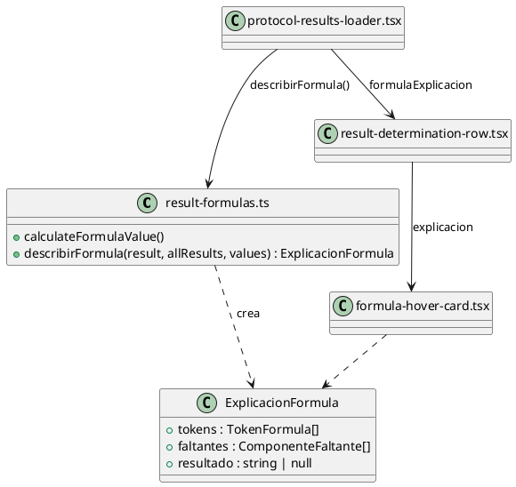
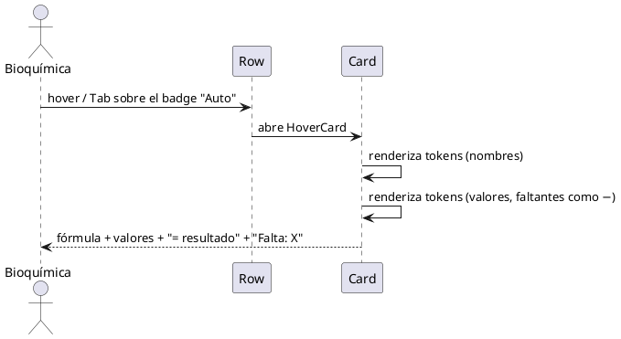

# Plan — Carga a mano debajo del input + fórmula real al hacer hover en "Auto"

Rama: `feature/carga-resultados-formula` (worktree, base `desarrollo`). Repo: `frontend/`.

## Contexto

En la carga de resultados de un protocolo (`src/components/results/components/result-determination-row.tsx`)
cada determinación es una fila. Las determinaciones calculadas traen `determination.formula`
y muestran un badge: **Auto** (la fórmula resolvió), **Fórmula pendiente** (falta un
componente) o **A mano** (`carga_manual`). Al lado del badge está hoy el botón
"Cargar a mano" / "Volver a la fórmula".

Dos pedidos del usuario:

1. El botón "Cargar a mano" está en la línea del nombre, lejos del input; se confunde con
   los badges de estado. Va **debajo del input del resultado**, con separación clara.
2. Al hacer hover en el badge **Auto** hay que ver la fórmula con la que se calculó ese
   resultado, **con los valores reales**. Si falta un componente, se muestra el nombre de
   la determinación que falta y en el cálculo va `−`. Tipografía matemática.

## Requerimientos

### Funcionales

- **RF1** El botón de alternar carga manual se muestra debajo del input de valor, dentro de
  la misma columna, con separación vertical explícita.
- **RF2** Estando la fila excluida ("Fuera del protocolo", naranja) o sin permiso, el botón
  se comporta igual que hoy: si `onToggleCargaManual` es `undefined`, no se renderiza.
- **RF3** El badge de fórmula (Auto / Fórmula pendiente / A mano) abre, al hover y al foco de
  teclado, una tarjeta con:
  - línea 1: la fórmula con los **nombres** de las determinaciones;
  - línea 2: la misma fórmula con los **valores reales**; los faltantes van como `−`;
  - línea 3: `= <resultado>` (o `= −` si no se pudo calcular);
  - al pie, si falta algo: `Falta: <nombre>` por cada determinación sin valor;
  - si la fila está en carga a mano, una aclaración de que la fórmula quedó de lado.
- **RF4** Los operadores se muestran con signos tipográficos: `×`, `÷`, `−`, `+`.
- **RF5** El nombre de un componente que no se encuentra en el protocolo se muestra por su
  código, no vacío.

### No funcionales

- **RNF1** La lógica de armado de la explicación es una **función pura** en
  `src/lib/result-formulas.ts`; no toca React ni el DOM.
- **RNF2** Sin dependencias nuevas de npm. La tipografía matemática entra por Google Fonts
  (`STIX Two Text`) declarada en `index.html` + token de tema Tailwind v4 en `index.css`.
  **No se agrega KaTeX**: las fórmulas del laboratorio son expresiones de una línea
  (`([cod_3] * 10) / [cod_1]`) y una tarjeta de hover no justifica ~280 kB de librería.
- **RNF3** `npm run build` con tipado limpio y `npm run lint` sin errores nuevos
  (baseline: 28 warnings, 0 errores).
- **RNF4** Accesible: el disparador es un elemento enfocable; `Tab` abre la tarjeta.

### Decisión de diseño anotada (alternativa descartada)

Se pidió evaluar layout de fracción en CSS cuando la fórmula divide. Se descarta en esta
tanda: una fracción fiel exige pasar de lista de tokens a **AST** y render recursivo, y las
fórmulas reales son de un solo nivel de división con paréntesis. Se resuelve con `÷` y los
paréntesis de la fórmula original, que ya es correcto matemáticamente. Si más adelante
aparecen fórmulas anidadas, la evolución natural es agregar el AST detrás de la misma
función pura, sin tocar el componente (Variaciones Protegidas).

## Diseño

Responsabilidades (GRASP):

- **Experto en Información**: `result-formulas.ts` ya tiene el mapa código→resultado, el
  normalizador de expresión y el cálculo; la explicación de la fórmula le corresponde a él.
- **Fabricación Pura**: `describirFormula` es una función sin estado, testeable de a una.
- **Bajo Acoplamiento**: `ResultDeterminationRow` **no** llama a `describirFormula`; recibe
  la explicación ya armada por `protocol-results-loader.tsx`, que es el Controlador que ya
  tiene `results` y `values` a mano (ahí ya se llama `calculateFormulaValue`).
- **Alta Cohesión**: el render de la tarjeta vive en su propio componente,
  `formula-hover-card.tsx`; la fila sólo lo ubica.





## Sub-tickets

### T1 — Botón "Cargar a mano" debajo del input
Archivo: `src/components/results/components/result-determination-row.tsx`.
Mover el bloque `{isFormula && onToggleCargaManual && (<button …>)}` de la cabecera a la
columna `lg:w-48`, después del input, de "En el informe" y del panel de valores anteriores,
con `mt-2`. Conservar textos, iconos, `title` y clases del botón; sacar el `ml-2`/`align-middle`
y agregar `aria-pressed={cargaManual}`.
Criterio: el botón aparece debajo del input con aire; la cabecera queda sólo con badges;
fila excluida y layout `lg:` intactos.

### T2 — `describirFormula` en `src/lib/result-formulas.ts`
Contratos exactos:

```ts
export type TokenFormula =
  | { tipo: "operador"; texto: string }        // × ÷ + − ( )
  | { tipo: "numero"; texto: string }
  | { tipo: "componente"; codigo: string; nombre: string; valor: string | null }

export type ComponenteFaltante = { codigo: string; nombre: string }

export type ExplicacionFormula = {
  /** La fórmula original, tal cual vino de la base. */
  formula: string
  tokens: TokenFormula[]
  faltantes: ComponenteFaltante[]
  /** Valor calculado; `null` si falta un componente o la expresión no evalúa. */
  resultado: string | null
}

export const describirFormula = (
  result: FormulaResult,
  allResults: FormulaResult[],
  values: Record<number, FormulaValue>,
): ExplicacionFormula | null
```

Reglas: `null` si no hay fórmula. Reutilizar `normalizeExpression`, `resolveRelativeCode`,
`buildResultCodeMap`, `buildCodesByNumber` y `extraerNumero`; `resultado` sale de
`calculateFormulaValue`. `valor` es el texto cargado tal cual (`values[id].value`), `null`
si falta o el componente está excluido. `nombre` sale de `determination.name`, o el código
si no se encuentra. Operadores traducidos: `*`→`×`, `/`→`÷`, `-`→`−`, `+`→`+`;
paréntesis como operador. Un componente faltante se lista una sola vez en `faltantes`.

### T3 — Tarjeta de hover + tipografía matemática
- `index.html`: `<link rel="preconnect">` a fonts.googleapis/gstatic y hoja de
  `STIX+Two+Text:ital,wght@0,400;0,600` con `display=swap`.
- `src/index.css`: bloque `@theme { --font-matematica: "STIX Two Text", "STIX Two Math", Cambria, Georgia, serif; }`
  (habilita `font-matematica` en Tailwind v4).
- `src/components/results/components/formula-hover-card.tsx`: componente
  `FormulaHoverCard({ explicacion, cargaManual, children })` con `HoverCard`/`HoverCardTrigger asChild`/
  `HoverCardContent` de `@/components/ui/hover-card`, `openDelay={150}`. Trigger enfocable
  (`<button type="button">` que envuelve al badge). Contenido: las tres líneas de RF3 en
  `font-matematica`, faltantes en gris chico.
- `result-determination-row.tsx`: nueva prop opcional `formulaExplicacion?: ExplicacionFormula | null`;
  si viene, el badge de fórmula se envuelve con `FormulaHoverCard`.
- `protocol-results-loader.tsx`: `const formulaExplicacion = isFormula ? describirFormula(result, results, values) : null`
  y pasarla a la fila.

Criterio: hover y `Tab` sobre el badge abren la tarjeta; con un componente sin cargar se
ve `−` en el cálculo y `Falta: <nombre>`; build y lint limpios.

## Criterios de aceptación

- `npm run build` sin errores de tipado.
- `npm run lint`: 0 errores, warnings ≤ 28.
- Sin dependencias nuevas en `package.json`.
- No hay infraestructura de tests (no hay vitest en el repo): no se agregan tests.
