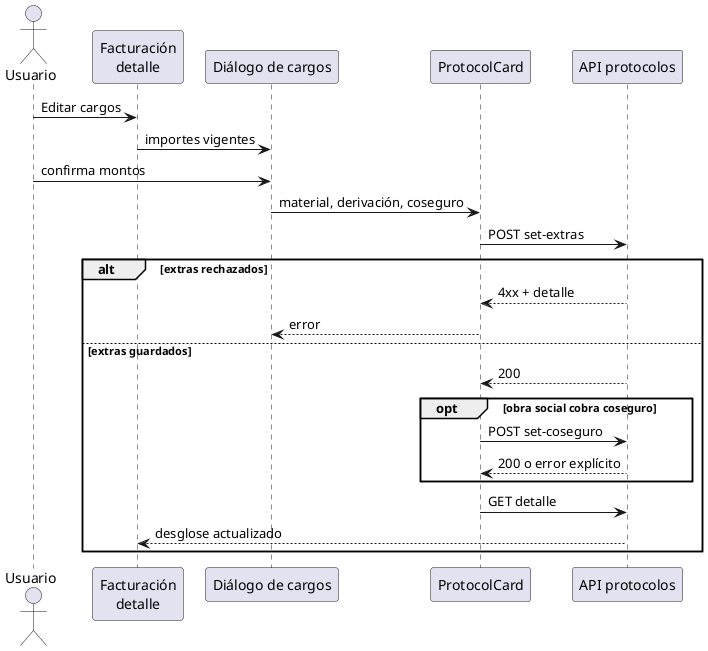

# Editar cargos desde el detalle del protocolo

## Pedido y contrato

En el contenedor **Facturación** del detalle de protocolo, dar una vía directa
para corregir los cargos estándar variables que ya muestra el desglose:
`coseguro`, `material descartable` y `derivación`.

Alcance de «etc.»: esos son los únicos conceptos estándar editables existentes
en el contrato actual. Los importes de análisis salen del nomenclador y no se
sobrescriben a mano; los cargos libres siguen en el gestor **Cobro no
contemplado**; los pagos se registran y corrigen por sus flujos propios.

No cambia la API. Se reutilizan:

- `POST /protocols/protocols/<id>/set-extras/` para material y derivación;
- `POST /protocols/protocols/<id>/set-coseguro/` para coseguro;
- el gestor actual para cargos no contemplados.

`set-extras` conserva el permiso `administrar_libro_diario`; no se amplían
facultades. `set-coseguro` conserva su regla: sólo acepta el cargo si la obra
social cobra coseguro. Protocolos no editables continúan bloqueados por backend
y por la interacción existente del detalle.

## Requisitos

### Funcionales

1. El contenedor Facturación ofrece una acción visible para editar juntos
   material descartable, derivación y coseguro.
2. El formulario abre con los importes vigentes del detalle y acepta montos
   monetarios no negativos.
3. Si la obra social no cobra coseguro, el campo queda deshabilitado y explica
   la causa; material y derivación permanecen disponibles según autorización.
4. Al confirmar, primero se actualizan material y derivación y, cuando aplica,
   el coseguro. Un fallo informa qué no se pudo guardar y no anuncia éxito.
5. Tras guardar, el detalle se refresca para mostrar desglose y saldo reales.
6. El gestor de cobros no contemplados permanece accesible desde el mismo
   contenedor.

### No funcionales

- Texto visible en español rioplatense y controles con etiquetas asociadas.
- Reusar `Dialog`, `Input`, `Button`, API y manejo de errores existentes.
- Mantener responsabilidades: el diálogo captura/valida; `ProtocolCard`
  orquesta endpoints y refresco; `ProtocolDetailView` presenta la acción.
- No modificar cálculos, modelos, datos clínicos, permisos ni PHI/PII.

## Casos de uso y validación

1. Usuario autorizado abre Facturación, modifica material, derivación y
   coseguro, guarda: se llaman ambos endpoints y el desglose se refresca.
2. Obra social sin coseguro: campo deshabilitado; se guardan sólo extras.
3. Monto vacío, no numérico o negativo: el formulario no envía y explica el
   error.
4. `set-extras` responde 403: se muestra el mensaje del backend; no se llama a
   coseguro ni se presenta éxito.
5. Extras guardados pero coseguro falla: se informa el fallo y se refresca para
   reflejar el estado real, sin ocultar el guardado parcial.
6. Usuario necesita un cargo libre: abre el gestor existente **Cobro no
   contemplado**.

## Ticket de implementación

Un coder modifica sólo frontend en esta rama:

- crear un diálogo cohesivo dentro de
  `src/components/protocolos/components/dialogs/` para los tres importes;
- exportarlo desde el índice de diálogos;
- reemplazar la acción aislada de coseguro del contenedor de Facturación en
  `protocol-detail-view.tsx` por **Editar cargos**;
- adaptar `protocol-card.tsx` para estado, apertura, llamadas secuenciales,
  mensajes y refresco;
- agregar pruebas focalizadas de render, validación, autorización/error y
  coordinación de endpoints, siguiendo la infraestructura disponible.

Aceptación: los seis casos anteriores quedan cubiertos, TypeScript compila,
ESLint de archivos tocados queda limpio y no hay cambios de backend.

## Estado

Completado. Implementación verificada en el commit `ddad6eb`.

Validaciones realizadas: TypeScript, ESLint de los archivos modificados y 14
tests backend de `laboratory.protocols.tests_correccion_del_cobro`. El warning
MySQL W036 continúa siendo conocido; el frontend no tiene runner de tests.
