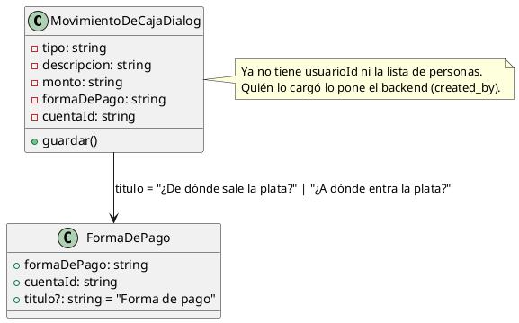

# Libro diario: sacar «Lo hizo» y dejar claro de dónde salió la plata

## Contexto

El 2026-09-22 (`docs/2026-09-22-autor-libro-diario.md`) se separó, en las filas de
caja del libro diario, «Lo hizo» (`usuario`) de «Registrado por» (`created_by`), y
el modal de carga sumó un selector «Lo hizo» con la lista de usuarios activos.

El usuario revisó la pantalla y decidió lo contrario: **no le interesa quién hizo
el gasto**. Lo que importa de una persona es quién lo registró —eso el sistema lo
sabe solo y no se elige— y lo que importa de la plata es **de dónde salió**:
efectivo del cajón o alguna cuenta. El resto (para quién, por qué, quién fue a
comprar) se escribe en la descripción, que es texto libre.

Cambio de criterio de producto, no un bug. Queda anotado en la doc previa.

## Requerimientos

### Funcionales

1. El modal «Agregar gasto o ingreso» no pide quién hizo el movimiento.
2. El POST a `/billing/movimientos-de-caja/` no manda `usuario`.
3. Las filas de gasto/ingreso del libro diario no muestran «Lo hizo»; siguen
   mostrando «Registrado por».
4. El origen del dinero (efectivo o cuenta con su nombre) se ve en el modal con
   un título que diga que es de dónde sale / a dónde entra la plata, y sigue
   siendo obligatorio para guardar.
5. En la fila del libro, el origen del dinero ya se ve (`textoMedioDePago`): no
   se toca.

### No funcionales

- Sin cambios de backend (`/Users/givecab/sibioq/backend` es sólo lectura).
- `npm run build` limpio; `npm run lint` sin errores y sin warnings nuevos
  (baseline 28).
- Nada de estado, tipos o imports muertos.

## Qué hace el backend si no llega `usuario` (verificado, sólo lectura)

- `billing/models.py:485` — `usuario = FK(CustomUser, null=True, blank=True,
  on_delete=SET_NULL)`. Es opcional a nivel base.
- `billing/serializers.py:477-479` — en `create()`:
  `if not validated_data.get('usuario'): validated_data['usuario'] = actor`,
  donde `actor` es `request.user`. Es decir: **si el frontend no manda `usuario`,
  el backend lo llena con quien está cargando**, el mismo que `created_by`.
- Conclusión: quitar el campo del payload no rompe nada, no deja nulos y no
  necesita migración ni cambio de serializer. El campo queda en la API,
  redundante con `registrado_por`; retirarlo sería una tarea de backend aparte
  (afecta `analytics/services.py:1005`, que arma la clave `usuario` de la fila
  del libro, y `billing/tests_movimientos_de_caja.py:110`, que la asevera).

## Otros lugares que mostraban «Lo hizo» (grep en `src/`)

Sólo dos, los dos en alcance:

- `src/components/caja/movimiento-de-caja-dialog.tsx:242` (label del select).
- `src/components/caja/libro-diario-page.tsx:618` (fila del libro).

No hay exportación a Excel/PDF ni pantalla de detalle en el frontend que use
`usuario` de un movimiento de caja. `src/types/index.ts:1861` y
`src/components/contingencia/pendientes-del-servidor.tsx:35` tienen un campo
`usuario`, pero son de `sync_feed` (contingencia), otra cosa: no se tocan.

## Diseño

Dos piezas independientes, un ticket cada una.

- **Variaciones Protegidas / OCP** en `FormaDePago`: el componente lo usan tres
  pantallas (`payment-dialog`, `forma-de-pago-dialog`, este modal). En vez de
  duplicar el bloque o cambiarle el texto a todos, se le agrega una prop
  opcional `titulo` con default `"Forma de pago"`. Los tres usos existentes
  siguen igual; el modal de caja le pasa el suyo.
- **Experto en Información**: el título depende del tipo (gasto vs ingreso), dato
  que vive en el modal; el modal lo calcula y lo pasa.

## Sub-tickets

### T1 — Modal: sacar «Lo hizo» y titular el origen del dinero

Archivos: `src/components/caja/movimiento-de-caja-dialog.tsx`,
`src/components/common/forma-de-pago.tsx`.

- `FormaDePago`: prop nueva `titulo?: string`, default `"Forma de pago"`, usada
  en el `<Label>` del bloque. Nada más cambia ahí.
- Modal: se eliminan `usuarioId`, `personas`, el tipo `Persona`, `nombreDe`, el
  `useEffect` que pide `USER_ENDPOINTS.USERS`, el bloque `
` del select
  `movimiento-usuario`, y `...(usuarioId ? { usuario: ... } : {})` del payload.
  Se sacan los imports que queden sin uso (`Select*`, `USER_ENDPOINTS`,
  `useAuth` si ya no se usa `user`).
- `<FormaDePago titulo={tipo === "gasto" ? "¿De dónde sale la plata? *" : "¿A dónde entra la plata? *"} ... />`
  y el comentario de al lado actualizado.
- Reescribir el bloque de comentario `QUIÉN LO HIZO NO ES SIEMPRE QUIEN LO CARGA`
  del encabezado del archivo: ahora se registra sólo quién lo cargó (lo pone el
  backend), y el resto va en la descripción. Documentar la realidad.
- `pagoCompleto` sigue siendo requisito de `puedeGuardar`: el origen queda
  obligatorio. No relajarlo.

Aceptación: el modal no ofrece elegir persona; guardar un gasto en efectivo y uno
por transferencia con cuenta funciona; sin forma de pago el botón queda
deshabilitado; el POST no lleva `usuario`; build y lint limpios.

### T2 — Libro diario: quitar «Lo hizo» de la fila

Archivo: `src/components/caja/libro-diario-page.tsx`.

- Borrar el `` de «Lo hizo:» (~l. 617-620). «Registrado por» queda, y como
  queda solo, el contenedor puede simplificarse pero sin cambiar su apariencia.
- Quitar `usuario?: string` de `FilaAgrupada` (ya nadie lo lee; el backend lo
  sigue mandando y se ignora). `autorInformado` sigue en uso para
  `registrado_por` y para los pagos.
- El bloque de `textoMedioDePago` con el ícono de billete/banco no se toca: ya
  muestra el origen del dinero.

Aceptación: la fila de un gasto muestra tipo, detalle, origen del dinero y
«Registrado por», y nada de «Lo hizo»; build y lint limpios.

## Criterios de aceptación globales

- `npm run build` sin errores de tipos.
- `npm run lint`: 0 errores, ≤28 warnings.
- Ningún cambio en `/Users/givecab/sibioq/backend`.
- Commits en español, sin firma de agente.
